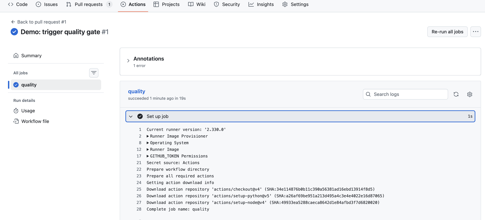

# DocsOps Quality Gate

A drop-in **documentation quality gate** for Pull Requests.  
Runs **lint + link checks + style/terminology**, then rolls everything up into a simple **0–100 scorecard** with an optional fail threshold.

Designed to be:
- **Writer-friendly** (actionable summaries, low noise)
- **CI-native** (reproducible, configurable, works in PRs)

---

## What it does

- Computes a **Docs Quality Score (0–100)** from:
  - **markdownlint** (Markdown conventions)
  - **lychee** (broken links)
  - **Vale** (style/terminology)
- Publishes a clean report in the **GitHub Actions Step Summary**
- Optionally **fails the workflow** if score drops below a threshold (default: **85**)

  


---

## What’s included

- **Python CLI**: `docsops score | report | check`
- **GitHub workflow**: `.github/workflows/quality-gate.yml`
- **Reusable composite Action**: `action/action.yml`
- Starter configs:
  - `configs/markdownlint-cli2.yaml`
  - `configs/lychee.toml`
  - `configs/vale/...`

---

## Quickstart (local)

```bash
python3 -m venv .venv
source .venv/bin/activate
pip install -e .

mkdir -p reports
docsops score
docsops report
docsops check --min-score 85
